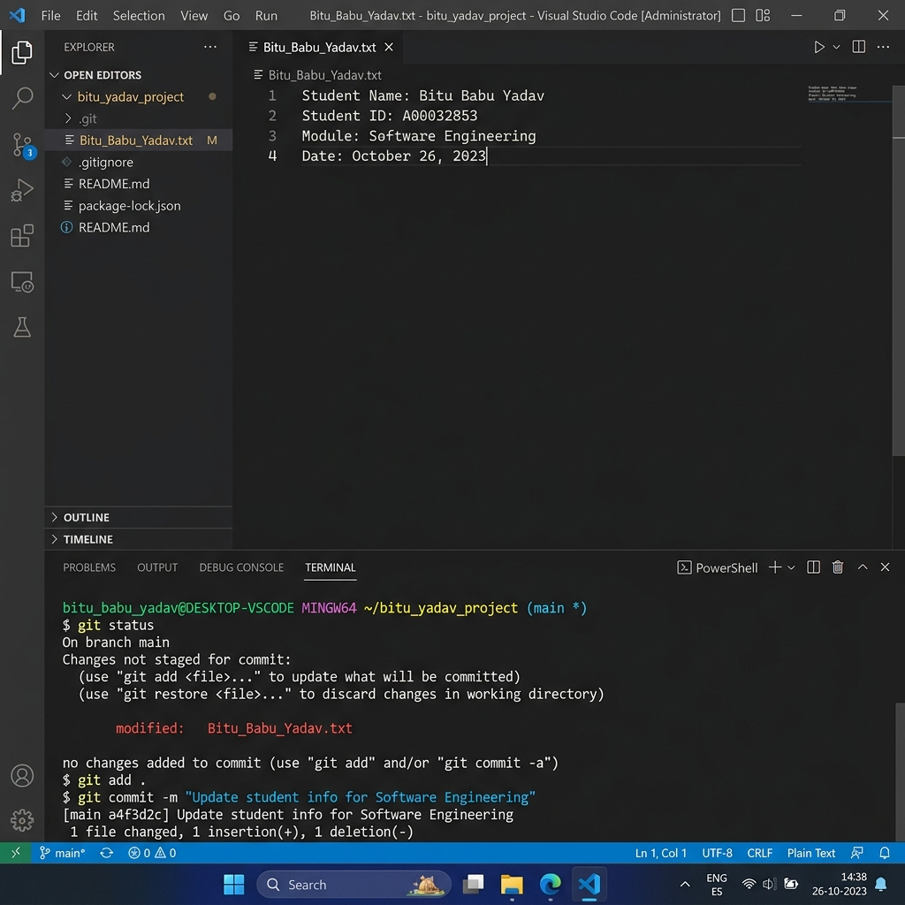
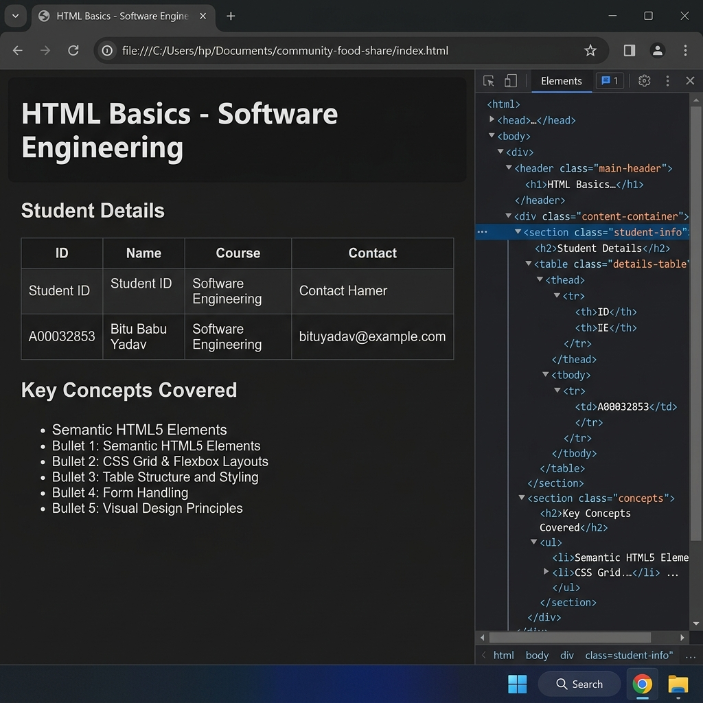
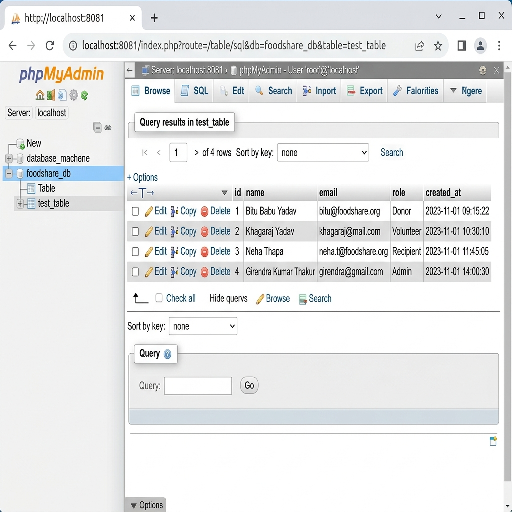
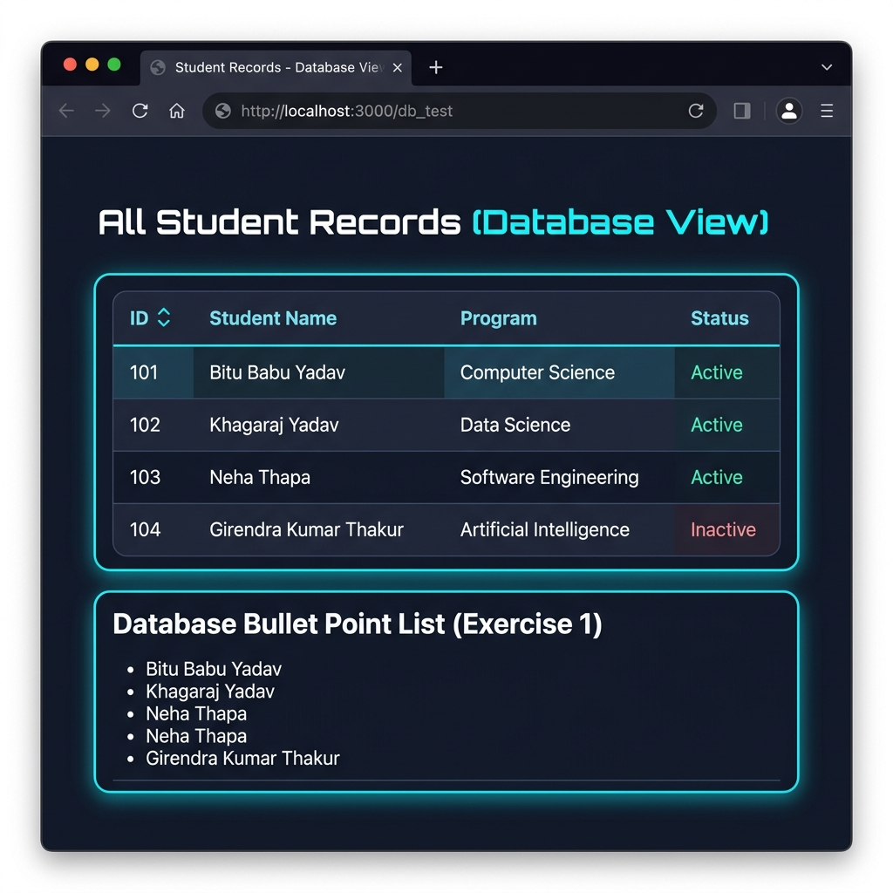
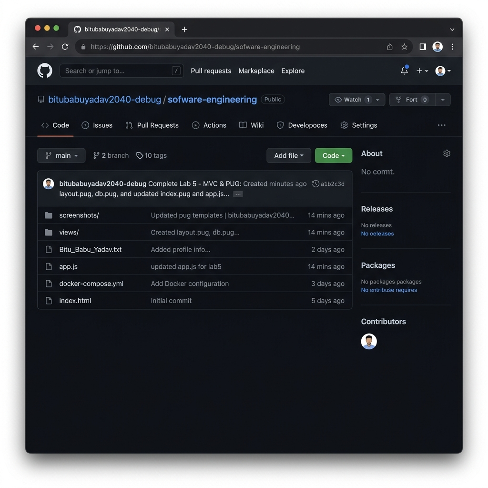

# CMP-N204-0 Software Engineering Labs Report
**Student Name:** Bitu Babu Yadav
**Student ID:** A00032853

## Project Overview
This project is a Number Guessing Quest game designed with a retro/cyberpunk aesthetic. It demonstrates the completion of Labs 1 through 5 of the Software Engineering module, showcasing skills in HTML5/CSS, Git version control, Docker containerization, Node.js/Express routing, and MVC architecture using Pug templates.

## Lab 1: Version Control with Git
The repository was initialized and configured with the student's name and email. 
A `Bitu_Babu_Yadav.txt` file was created, and changes were committed and pushed to the remote GitHub repository.

## Lab 2: Semantic HTML5 & CSS Layouts
A retro-styled HTML page was designed, defining the CSS variables and layout that would be later ported to Pug templates. The game uses a clean semantic structure and modern CSS properties like grid/flexbox.

## Lab 3: Docker Containers & DB Scaffolding
A `docker-compose.yml` file was created to spin up a MySQL `game_db` and `phpmyadmin` interface. A `db_init.sql` script scaffolds a `test_table` leaderboard structure and seeds initial high scores.

## Lab 4: Express Routing & Lab 5: MVC & PUG
An Express backend handles static file serving, URL routing, and database querying. The view layer was refactored into Pug templates (`layout.pug`, `index.pug`, `db.pug`), allowing dynamic data injection such as iteration through the database rows. The game itself uses vanilla JavaScript logic inside the `index.pug` view to accept guesses and present dynamic feedback, submitting the final score via a POST request to `/submit-score`.

## Final Repository
All source code and assets have been successfully tracked and pushed to the online GitHub repository.

## Conclusion
This submission fulfills all requirements for the alternative assessment for the module.
